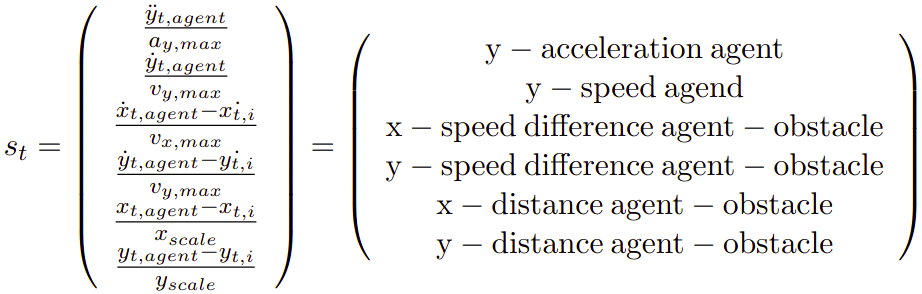
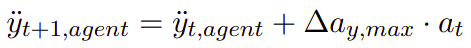
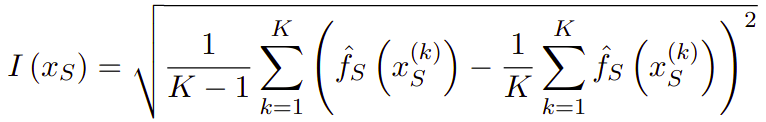
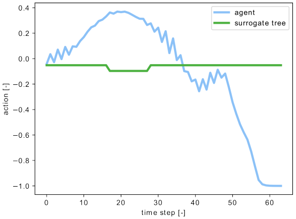
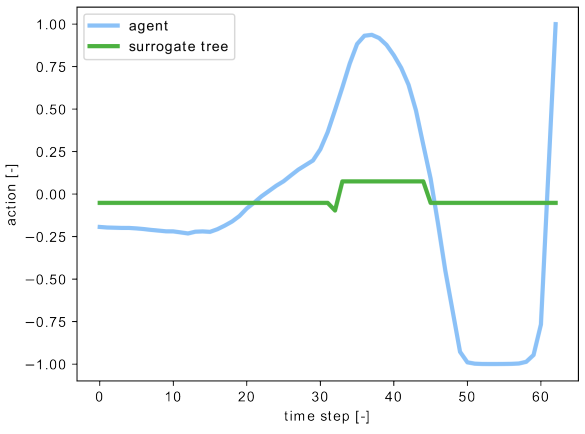

# Explainability in Deep Reinforcement Learning

This folder contains the helper scripts that were applied in the project.
The applications of the methods during the agent's training are in [train_continuos_explainer.py](../run/train_continuous_explainer.py) and [train_continuos_iPDP.py](../run/train_continuous_iPDP.py).

## Abstract
With the combination of Reinforcement Learning (RL) and Artificial Neural Networks, Deep Reinforcement Learning (DRL) agents are shifted towards being non-interpretable black-box models.
Developers of DRL agents, however, could benefit from enhanced interpretability of the agents' behavior, especially during the training process.
Improved interpretability  could enable developers to make informed adaptations, leading to better overall performance.
The explainability methods Partial Dependence Plot (PDP) [1], Accumulated Local Effects (ALE) [2] and SHapley Additive exPlanations (SHAP) [3] were considered to provide insights into how an agent's  behavior evolves during training.
Additionally, a decision tree as a surrogate model was considered to enhance the interpretability of a trained agent.
In a case study, the methods were tested on a Deep Deterministic Policy Gradient (DDPG) agent that was trained in an obstacle avoidance scenario.
PDP, ALE and SHAP were evaluated towards their ability to provide explanations as well as the feasibility of their application in terms of computational overhead.
The decision tree was evaluated towards its ability to approximate the agent's policy as a post-hoc method.
Results demonstrated that PDP, ALE and SHAP were able to provide valuable explanations during the training.
Each method contributed additional information with their individual advantages.
However, the decision tree failed to approximate the agent's actions effectively to be used as a surrogate model.

## Case Study: Obstacle Avoidance
The RL agent was trained in a simple two-dimensional environment consisting of two moving obstacles with a constant distance relative to each other.
The agent's aim was to pass in between the obstacles. [4]

||
|:--:|
|Obstacle avoidance environment taken from [4].|

The state was represented by six features:

Based on the state representation, the agent computed an action $a_{t} \in [-1,1]$.
This action was then mapped to the agent's acceleration in lateral direction:

The DRL agent was trained for $4 \cdot 10^{6}$ time steps.
During the training, the above mentioned explainability methods PDP, ALE and SHAP where applied with a frequency of $10^{5}$ time steps.
At each evaluation step, the states encountered by the agent in the the previous $10^{5}$ time steps were used as the data set for the calcualtion of the explainability methods.
Furthermore, the incremental PDP (iPDP) [5], an adaption of the PDP to dynamic modeling scearios, was applied at every time step.
The aim was to investigate, how the importance of the individual feautres for the agent's decisions changed over time with a progressing training process.

<!-- formula feature importance -->
The feautre importance based on the PDP and ALE was calculated based on the motivation that "any [feature] for which the PDP is "flat" is likely to be less important than those [features] whose PDP varies across a wider range of the response" [6]:

The feautre importance based on the SHAP values was determined by calculating the average absolute Shapley value across the whole data set [7].

A decision tree was applied post-hoc as a surrogate model to the agent to investigate, if this method can provide further explanations about the agent's policy.
Therefore, the tree was trained on $10^{5}$ states and the agent's actions calculated on these states.
A decision tree with a maximal depth of six was considered to be the cut-off before the tree itself turn into a black-box model.

## Results

### Methods applied during the training
The iPDP resulted in an average increase of runtime of 10.32 hours compared to training without the applicaiton of any explainability methods.
This was considered to be unfeasable for the method to work in this scenario.
Thereofore, no further investigations were conducted on the iPDP.

PDP, ALE and SHAP produced similar results in terms of feature importance of the individual feautres:

|PDP Results|
|:--:|
||
|PDPs of the individual features in the state representation at time step $2 \cdot 10^{6}$.|
||
|Feature importance calculated based on the PDP over the agent's training process for $4 \cdot 10^{6}$ time steps.|

|ALE Results|
|:--:|
||
|ALEs of the individual features in the state representation at time step $2 \cdot 10^{6}$.|
||
|Feature importance calculated based on the ALE over the agent's training process for $4 \cdot 10^{6}$ time steps.|

|SHAP Results|
|:--:|
||
|SHAP dependence plots of the individual features in the state representation at time step $2 \cdot 10^{6}$. 200 data points were used for the calculation.|
||
|Feature importance calculated based on SHAP over the agent's training process for $4 \cdot 10^{6}$ time steps.|

 
<!-- true computational costs -->
The application of the explainability add computational costs to the agent's training process.
SHAP introduces by far the highest computational costs, followed by PDP.
Compared to the other methods, ALE introduces the lowest computational costs.

<!-- computational costs here -->
The methods were applied in a way to address for the trade-off between reliable results by including a high number of data points and keeping the computational costs low.
At each evaluation step during the training, PDP and ALE were both calculated with the same set of $10^{5}$ data points.
The PDP was calculated for five grid points, whereas the number of grid points for the ALE calculation was determined algorithmically such that ten data points fall in each interval vetween two adjacent grid points.
SHAP was calculated on 200 data points radomly sampled from the $10^{5}$ data points used for PDP and ALE.

||
|:--:|
|Runtimes of the methods PDP, ALE and SHAP during a single evaluation step at every $10^{5}$ time steps. The runtimes were measured during three training runs with the same settings.|

### Surrogate Model

The performance of the decision tree was evaluated on the training and test data set by the metrics Mean Absolute Error (MAE) and Mean Squared Error (MSE).

|Depth|MAE training [-]|MSE training [-]|MAE test [-]|MSE test [-]|
|:---:|:---:|:---:|:---:|:---:|
|3|0.585|0.445|0.586|0.447|
|4|0.584|0.445|0.586|0.447|
|5|0.584|0.444|0.586|0.448|
|6|0.583|0.443|0.586|0.448|

 
Furthermore, the decision tree's ability to approximate the agent's decisions was evaluated in newly sampled environments.
Therefore, the agent was applied in those envornments and the agent's actions were compared to the tree's outputs on the encountered states.

<table>
  <tr>
    <td>
      

        
      

    </td>
    <td>
      

        
      

    </td>
  </tr>
  <tr>
    <td colspan="2">
      
Comparison of the agent's actions and the tree's output on the encountered states in two newly sampled environments. The tree used for the visualization had a depth of six.

    </td>
  </tr>
</table>

## Conclusion

The methods applied during the training were able to provide explanations about the
individual features’ influence on the agent’s actions.
The PDP adds plots with a simple and clear interpretation.
However, the grid resolution had to be small to limit the computational overhead.
The ALE could be computed at a much higher grid resolution with a computational overhead in the same range as the PDP. 
Therefore, the influence of the individual features are visualized more detailed.
Additionally, the ALE method accounts for correlations between features while the PDP might be influenced by them.
The SHAP method added more detailed insights about the influence of the individual features than the previous methods.
Instead of averages, values for individual data points are visualized.
This can reveal if trends found by the previous methods are actually present or if they resulted from averaging over predictions without any trend.
However, as a result of a large computational overhead, the SHAP method was calculated only for 200 data points instead of $10^{5}$ data points used by the other methods.
Therefore, the results of the SHAP method might be less reliable than the results of
PDP and ALE.

The decision tree was not able to approximate the agent's actions well enough to provide further explanations as a surrogate model.
Linear model trees showed more promising results and could be applied in further studies [8].

## Bibliography

[1] Friedman, Jerome H: Greedy function approximation: a gradient boosting machine. Annals of statistics, pages 1189–1232, 2001.

[2] Apley, Daniel W and Jingyu Zhu: Visualizing the effects of predictor variables in black box supervised learning models. Journal of the Royal Statistical Society Series B: Statistical Methodology, 82(4):1059–1086, 2020.

[3] Lundberg, Scott M and Su-In Lee: A unified approach to interpreting model predictions. Advances in neural information processing systems, 30, 2017.

[4] Hart, Fabian, Martin Waltz and Ostap Okhrin: Missing Velocity in Dynamic Obstacle Avoidance based on Deep Reinforcement Learning. arXiv preprint arXiv:2112.12465, 2021.

[5] Muschalik, Maximilian, Fabian Fumagalli, Rohit Jagtani, Barbara Hammer and Eyke Hüllermeier: iPDP: On Partial Dependence Plots in Dynamic Modeling Scenarios. In World Conference on Explainable Artificial Intelligence, pages 177–194. Springer, 2023.

[6] Greenwell, Brandon M, Bradley C Boehmke and Andrew J McCarthy: A simple and effective model-based variable importance measure. arXiv preprint arXiv:1805.04755, 2018.

[7] Lundberg, Scott M, Gabriel Erion, Hugh Chen, Alex DeGrave, Jordan M Prutkin, Bala Nair, Ronit Katz, Jonathan Himmelfarb, Nisha Bansal and Su-In Lee: From local explanations to global understanding with explainable AI for trees. Nature machine intelligence, 2(1):56–67, 2020.

[8] Gjærum, Vilde B, Inga Strümke, Jakob Løver, Timothy Miller and Anastasios M Lekkas: Model tree methods for explaining deep reinforcement learning agents in real-time robotic applications. Neurocomputing, 515:133–144, 2023.

Molnar, Christoph: Interpretable Machine Learning. 2 edition, 2022.